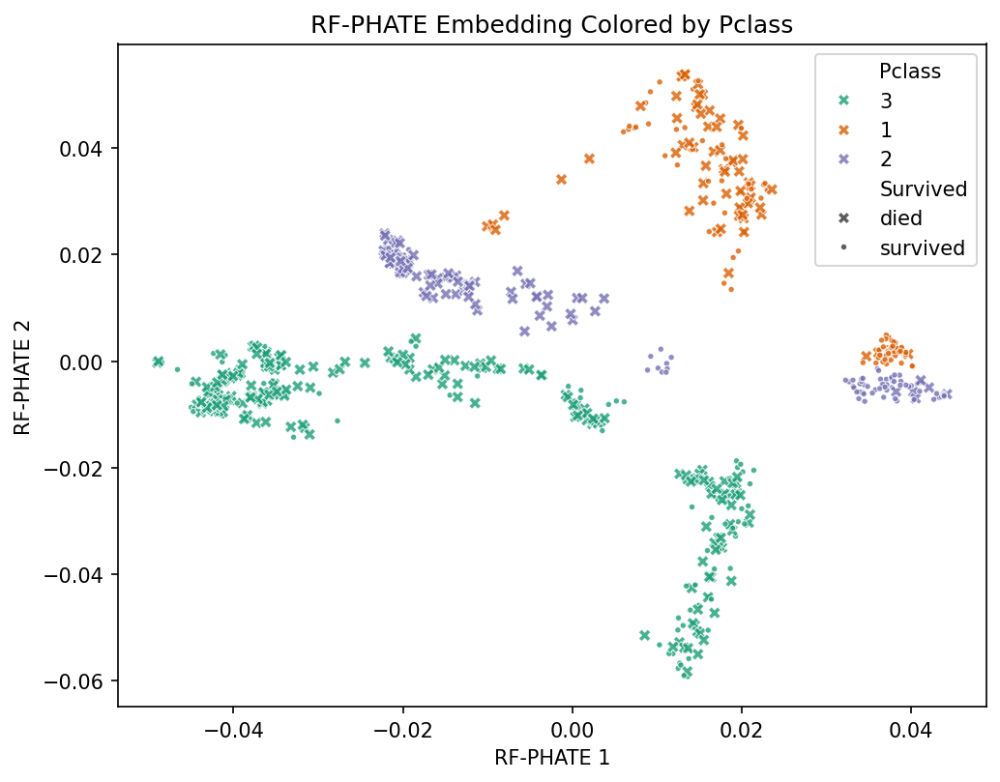
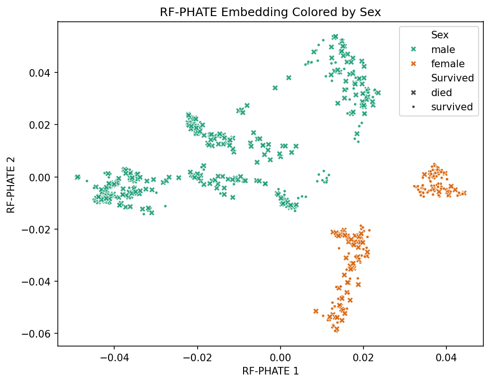

# RF-PHATE

RF-PHATE creates supervised, low-dimensional embeddings from forest proximity
matrices and a PageRank PHATE operator. It is designed for exploratory data
analysis when the target variable should guide the geometry of the embedding.

The current implementation builds proximities with
[`forestgeom`](https://github.com/JakeSRhodesLab/forestgeom) `Proximity`
objects, using scikit-learn forest estimators under the hood.

A repository with scripts to replicate the main quantification comparisons from
the paper is available at
[RF-PHATE-Quantification](https://github.com/jakerhodes/RF-PHATE-Quantification).

## Installation

Install RF-PHATE from GitHub with `pip`:

```bash
pip install git+https://github.com/jakerhodes/RF-PHATE
```

Core dependencies include `forestgeom>=0.4.0`, `graphtools`, `phate`,
`scikit-learn`, `numpy`, `scipy`, and `pandas`. Demo plotting additionally uses
`seaborn`, `plotly`, and `nbformat`.

## Forestgeom Refactor

RF-PHATE now delegates random forest proximity construction to
`forestgeom.Proximity`. The `RFPHATE` class wraps a supplied ensemble in
`Proximity` and passes the resulting proximity matrix to `PageRankPHATE`.

Important API points:

- `forest` accepts an estimator instance supported by forestgeom, including
  classifiers, regressors, and compatible ensemble adapters. When omitted or
  set to `None`, it uses `RandomForestClassifier()` with scikit-learn defaults.
  Configure forest settings directly on the estimator. Forestgeom clones and
  fits unfitted estimators and reuses fitted estimators.
- `random_state` and `n_jobs` configure `PageRankPHATE`. Configure the forest's
  random seed and parallelism on the supplied estimator.
- `proximity_params` are passed to `forestgeom.Proximity`.
  The supported option is `weight_scheme`: `"uniform"`, `"oob"`, `"gap"`
  (the RF-PHATE default), `"kerf"`, or `"boosted"`. Forestgeom 0.4 returns
  sparse matrices by default and no longer accepts `matrix_type`.
- `phate_params` are passed to `PageRankPHATE`.
  Typical keys include `n_components`, `t`, `n_landmark`, `verbose`,
  `mds_solver`, and `beta`.
- RF-PHATE always enforces `phate_params["knn_dist"] = "precomputed_affinity"`.
- `force_symmetric` and `adjust_diagonal` are training-kernel options passed
  to `fit` or `fit_transform`.
- `transform(data)` embeds new observations using the fitted forest proximity
  model and PHATE graph interpolation.

## Quick Demo

```python
from pathlib import Path

import matplotlib.pyplot as plt
import seaborn as sns
import rfphate
from sklearn.ensemble import RandomForestClassifier

Path("figures").mkdir(exist_ok=True)

data = rfphate.load_data("titanic")
x, y = rfphate.dataprep(data)

rfphate_op = rfphate.RFPHATE(
    random_state=42,
    n_jobs=-1,
    forest=RandomForestClassifier(
        n_estimators=100, random_state=42, n_jobs=-1, verbose=1,
    ),
    proximity_params={
        "weight_scheme": "gap",
    },
    phate_params={
        "verbose": 1,
        "mds_solver": "sgd",
    },
)

emb = rfphate_op.fit_transform(
    x,
    y,
    force_symmetric=True,
    adjust_diagonal=True,
)

plot_data = data.assign(
    **{
        "RF-PHATE 1": emb[:, 0],
        "RF-PHATE 2": emb[:, 1],
        "Pclass": data["Pclass"].astype(str),
    }
)
```

Color the embedding by passenger class and use marker style for survival. The
saved PNG uses the same `plot_data` coordinates built from `emb` above:

```python
plt.figure(figsize=(7, 5.5), dpi=150)
plot = sns.scatterplot(
    data=plot_data,
    x="RF-PHATE 1",
    y="RF-PHATE 2",
    hue="Pclass",
    style="Survived",
    markers={"survived": ".", "died": "X"},
    alpha=0.8,
    palette="Dark2",
)
plot.set_title("RF-PHATE Embedding Colored by Pclass")
plot.set_xlabel("RF-PHATE 1")
plot.set_ylabel("RF-PHATE 2")
plt.savefig("figures/titanic_pclass.png", bbox_inches="tight")
plt.show()
```



Color the same embedding by passenger sex. The saved PNG uses the same
`plot_data` coordinates built from `emb` above:

```python
plt.figure(figsize=(7, 5.5), dpi=150)
plot = sns.scatterplot(
    data=plot_data,
    x="RF-PHATE 1",
    y="RF-PHATE 2",
    hue="Sex",
    style="Survived",
    markers={"survived": ".", "died": "X"},
    alpha=0.9,
    palette="Dark2",
)
plot.set_title("RF-PHATE Embedding Colored by Sex")
plot.set_xlabel("RF-PHATE 1")
plot.set_ylabel("RF-PHATE 2")
plt.savefig("figures/titanic_sex.png", bbox_inches="tight")
plt.show()
```



## Train/Test Embedding

Fit RF-PHATE on training data, then embed held-out observations with
`transform`:

```python
from sklearn.model_selection import train_test_split

x_train, x_test, y_train, y_test = train_test_split(
    x, y, test_size=0.25, random_state=42, stratify=y
)

rfphate_split_op = rfphate.RFPHATE(
    forest=RandomForestClassifier(random_state=42, n_jobs=-1),
    random_state=42,
    n_jobs=-1,
    proximity_params={
        "weight_scheme": "gap",
    },
)

emb_train = rfphate_split_op.fit_transform(
    x_train,
    y_train,
    force_symmetric=True,
    adjust_diagonal=True,
)
emb_test = rfphate_split_op.transform(x_test)
```

## Citation

If you find RF-PHATE useful, please cite:

Rhodes, J.S., Aumon, A., Morin, S., et al. Gaining Biological Insights through
Supervised Data Visualization. Nature Computational Science (2026).
https://doi.org/10.1038/s43588-026-00999-7.
