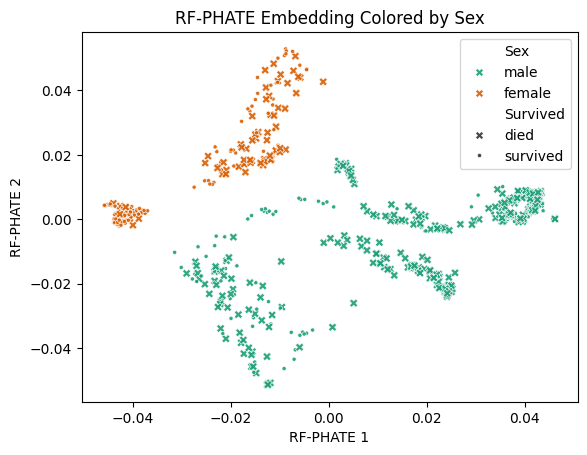

README - RF-PHATE
=================

RF-PHATE is an algorithm that allows the user to create random forest-based supervised, low-dimensional embeddings based on the manifold learning algorithm described in "Gaining Biological Insights through Supervised Data Visualization" [1]_.

A repository that contains scripts to replicate the main quantification comparison results from the paper can be found here: `RF-PHATE-Quantification <https://github.com/jakerhodes/RF-PHATE-Quantification>_`.

.. Documentation
.. -------------

.. For documentation, please visit `ReadTheDocs: RF-PHATE <https://jakerhodes.github.io/RF-PHATE/>`_.

Installation and updating
-------------------------

Use the package manager `pip` to install RF-PHATE. Rerun this command to check for and install updates. Installation should take no more than 5 minutes. The package requires `python>=3.7`.

.. code-block:: bash

    pip install git+https://github.com/jakerhodes/RF-PHATE

The random forest implementation is based on either `RandomForestClassifier <https://scikit-learn.org/stable/modules/generated/sklearn.ensemble.RandomForestClassifier.html>`_ or `RandomForestRegressor <https://scikit-learn.org/stable/modules/generated/sklearn.ensemble.RandomForestRegressor.html>`_ from `scikit-learn <https://scikit-learn.org/stable/>`_, depending on the type of response variable (categorical or continuous). The user implicitly chooses the type of random forest model by including either the response variable, `y`, or by stating the `prediction_type` as either 'classification' or 'regression'. If neither `y` nor `prediction_type` is given, RF-PHATE will assume a categorical response. Any training options available for `RandomForestClassifier <https://scikit-learn.org/stable/modules/generated/sklearn.ensemble.RandomForestClassifier.html>`_ or `RandomForestRegressor <https://scikit-learn.org/stable/modules/generated/sklearn.ensemble.RandomForestRegressor.html>`_ will work for the RF-PHATE initialization.

Quick Demo
----------

Below is a quick demo of how to use RF-PHATE on the Titanic dataset:

.. code-block:: python

    import matplotlib.pyplot as plt
    from rfphate import RFPHATE
    from rfphate.dataprep import dataprep
    import pandas as pd
    import seaborn as sns

    # Load the dataset
    data = pd.read_csv('rfphate/datasets/titanic.csv')

    # Prepare the data
    x, y = dataprep(data, encoding = 'integer')

    # Initialize and fit the RFPHATE model
    rfphate = RFPHATE(y = y, random_state = 42)
    emb = rfphate.fit_transform(x, y)

We can visually explore the relationships between the response (survival) and other feature variables:

By passenger class:

.. code-block:: python

    plot = sns.scatterplot(x = emb[:, 0], y = emb[:, 1], hue = pd.Categorical(data['Pclass']), markers = {'survived': '.', 'died': 'X'}, style = data['Survived'], alpha = .8, palette = 'Dark2')
    plot.set_title('RF-PHATE Embedding Colored by Pclass')
    plot.set_xlabel('RF-PHATE 1')
    plot.set_ylabel('RF-PHATE 2')

By passenger sex:

.. code-block:: python

    plot = sns.scatterplot(x = emb[:, 0], y = emb[:, 1], hue = data['Sex'], markers = {'survived': '.', 'died': 'X'}, style = data['Survived'], alpha = .9, palette = 'Dark2')
    plot.set_title('RF-PHATE Embedding Colored by Sex')
    plot.set_xlabel('RF-PHATE 1')
    plot.set_ylabel('RF-PHATE 2')

If you find the RF-PHATE method useful, please cite:

References
----------
.. [1] 
    Rhodes, J.S., Aumon, A., Morin, S., et al.: Gaining Biological Insights through Supervised
    Data Visualization. bioRxiv (2023). https://doi.org/10.1101/2023.11.22.568384.
